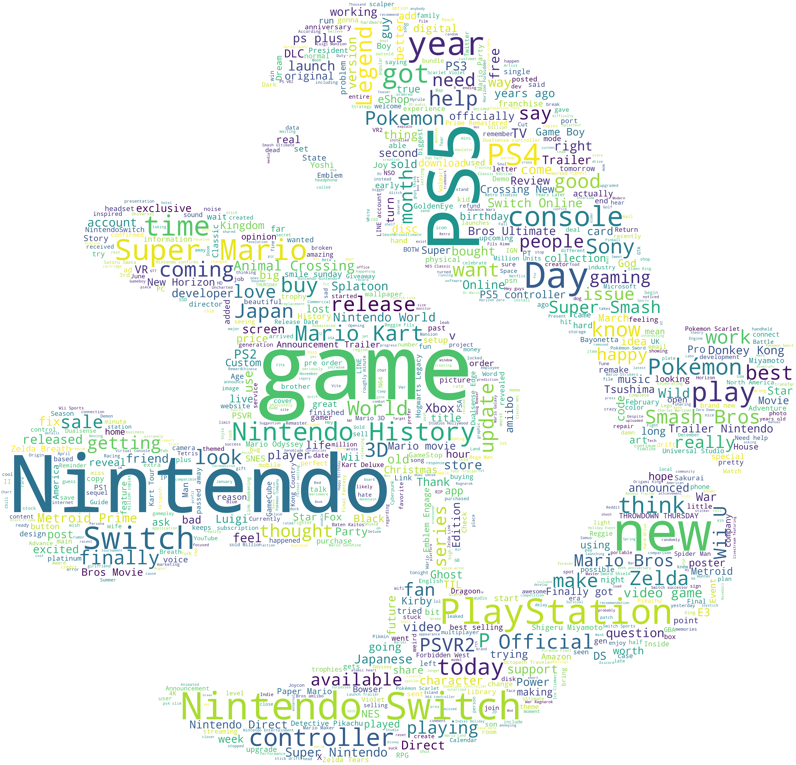
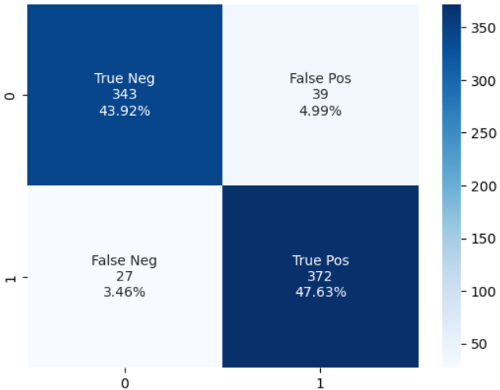
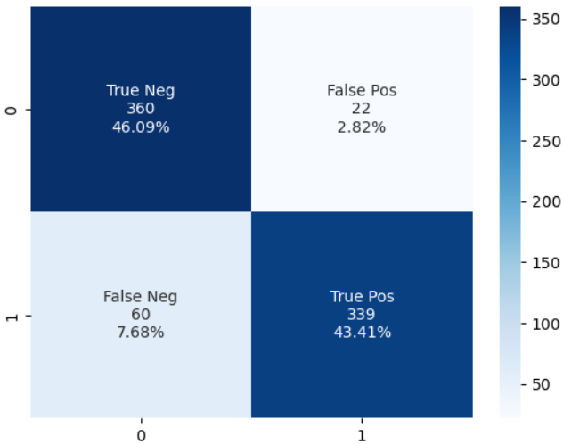

# Nintendo vs PlayStation
---

Content
1. [Introduction](#Introduction)
2. [Problem Statement](#Problem-Statement)
3. [Data Gathering](#Data-Gathering)
4. [Data EDA](#Data-EDA)
5. [Modelling](#Modelling)

---
## Introduction

From the title of this project, it should be obvious that I side with Nintendo.  
Jokes aside, this is a toy project but it may still serve some purpose.  
There may be a need to identify if a comment is posted on Twitter by Nintendo or PlayStation in several scenarios.  

1. Research on gaming industry: If someone wants to analyze how different companies are perceived by consumers, identifying which comments come from Nintendo or PlayStation can be useful.    
2. Marketing campaigns: Nintendo or PlayStation may want to monitor Twitter to gauge how successful their marketing campaigns are, and whether they are resonating with their target audience.
3. Product development: Companies may want to analyze the feedback on Twitter to identify what features and products their customers are asking for, and adjust their product development accordingly.

The repo is organised in the following structure:
```console
.                                 
├── code                                                                                                                
│   ├── data_eda.ipynb                                                                                                  
│   ├── modelling.ipynb                                                                                                                                
│   └── scrape_reddit.ipynb                                                                                             
├── data                                                                                                                
│   ├── combined_df.csv                                                                                                 
│   ├── nintendo_posts.csv                                                                                              
│   ├── playstation_posts.csv                                                                                           
│   ├── stopwords.pkl                                                                                                   
│   └── test_results.csv                                                                                                
├── img                                                                                                                 
│   ├── basic_nb.png                                                                                                    
│   ├── log.png                                                                                                         
│   ├── mario_cloud.png                                                                                                 
│   ├── mario.png                                                                                                       
│   ├── nintendo.png                                                                                                    
│   ├── no_lemma.png                                                                                                    
│   ├── no_stem_n_lemma.png                                                                                             
│   ├── no_stem.png                                                                                                     
│   ├── ntd_ps_1st.png                                                                                                  
│   └── remove_link_stripe.png                                                                                          
├── model        
│   ├── log_reg_prod.joblib 
│   └── prelim_model.joblib                                                                                             
├── Nintendo vs Playstation.pdf                                                                                     
└── README.md  
```

---
## Problem Statement

Now, imagine that I am working for reddit and now reddit want to simplify the content posting process, so I employ an automated forum control tool, for users from r/nintendo and r/playstation.  
For example, I want to post some random thoughts, I really just want to make a quick post and I don't want to go to the individual forum.  
All I want to do is simply post, and as if by magic, this post will appear in the correct subreddit.  
This makes life so much simpler!  
 
Now, before I push the post to the Nintendo/ PlayStation fans, I will first need to identify where these posts come from.  
Believe me, nintendo and sony had a long history of war between them...([Read more here](https://venturebeat.com/games/the-story-behind-nintendos-betrayal-of-sony-and-how-it-created-its-fiercest-rival/))   
I defientely wouldn't want to mix up nintendo and sony...   
So...   
I have to create some way to distinguish the nintendo posts from playstation!   
By using a classifier and my NLP techniques.  
I decided to gather some reddit posts and make a classifier which can identify is the post is from r/nintendo or r/playstation.  

For this project, my goal is two-fold:  
1. I will collect posts from two subreddits. `r/nintendo` and `r/playstation`, using API.  
2. I will then use NLP to train a classifier on which subreddit a given post came from. This is a binary classification problem.  

My classifier should have accurate prediction.  
It should have high f1 score, meaning both precision, the precentage of correctly making a positive prediction; and recall, precentage of actual positive detected ("recalled") by the classifier, should be high.  
F1 score, the harmonic mean/ weighted average of recall and precision need to be high for my classifier.  
It also should be relatively light weight and easy to use.  
It will be built using TFIDF.  

---
## Data Gathering

The data from `r/nintendo` and `r/playstation` will be gathered using `praw`, [The Python Reddit API Wrapper](https://praw.readthedocs.io/en/stable/).  
These data will then be saved into 2 different csv files under the `data` folder.  
They are:  
[nintendo_posts.csv](./data/nintendo_posts.csv)  
[playstation_posts.csv](./data/playstation_posts.csv)

A class function is written for this task.  
It will be able to automate the collection of data.  
It can also save and extend the current csv file should new data under the same topic appear.  
A simple way to obtain the possible attribute and methods for the PRAW package is also included.  
More deatils are given in the note book itself.  

### Data dictionary
|no|feature|description|
|-|-|-|
|1|id|the unique id to each reddit post, used to make only 1 post is scrapped|
|2|title|title of the post scrapped|
|3|post_content|if the post is word post, then post content exit|

---
### Data EDA

Features like user, posting habbits like use of emojis and use of pictures were examined.
The number of occurance of words are counted, length of titles are also examined.
Distribution of number of words used to form title are presented graphically.  
Occurance of each words are for the top words are also examined.  

Out of the 3904 posts collected, only 2750 users are unique.
This means that there are many users who posted more than 1 post.
They are probably the very active users.
To my surprise, the number of users who posts on both r/nintendo and r/playstation is very few...
There are only 9 users out of 2750 unique users in total...

Top 15 words in ascending order:
|words|	count|
|-|-|
|play|	95|
|history|	100|
|years|	103|
|got|	111|
|ps4|	124|
|day|	148|
|playstation|	166|
|super|	196|
|new|	235|
|games|	276|
|mario|	309|
|switch|	366|
|game|	367|
|ps5|	403|
|nintendo|	882|

Summary Statistics:
||	title_word_count|	title_len|
|-|-|-|
|count|	3904.000000|	3904.000000|
|mean|	11.070697|	62.437244|
|std|	7.165345|	40.521917|
|min|	1.000000|	2.000000|
|25%|	6.000000|	33.000000|
|50%|	10.000000|	54.000000|
|75%|	14.000000|	81.000000|
|max|	55.000000|	299.000000|

A word cloud is generated:  
</img>

Then, a simple basic and most naive model that may not even worth 1 point in GA is built.  
It uses TFIDF and Multinominal Naive Bayes.   
Multinominal Naive Bayes is used becuase the text data is not normally distributed.  
TFIDF is used because the number of occurance of the term is not as important as the term itself.   
Hence I also look at the number of appearance of a term in a single document (1 title).  
The results are good, simply because the give away words are not removed.  

Results for the most basic NB model are:  

- The recall of this inference is: 0.93
- The precision of this inference is: 0.91
- The f1 score for this inference is: 0.92

The confusion matrix is:  
</img>

Removing the key give away words like `nintendo` and `playstation` decreases the model performance slightly, but not too much.  
Removing words like `got` and `day` had no impact on the test set.  
This result is very likely due to the use of TF-IDF in the tokeninsation process.  

---
### Modelling

The models tried out are:
1. Navie Bayes
2. Logistic Regression
3. Random Forest
4. XGBoost

A navie baseline model is also built to show how good these models tried when compared against the most naive random guesses.  

After which, pipeline is built with TF-IDF as the first step and the respective algorithms for prediction as the second step.  
Results are analysed using a test set making up 20% of the entire collected data set.  
This test set is not used in training at all.  
The prediction result on the validation set is also reviewed to see if the model can generalise well.  
Predictions made by the models are then saved into a file [test_results.csv](./data/test_results.csv) for comparison. 

The detailed analysis is done for each models above, and just to repeat, models mostly have similar performance.  
It is concluded that the corpus is extremely important in this case.   
There tend to be a higher number of false negatives for all models.   
This is to be expected.  
Looking back to the base line model, it can be seen that there's also more false negatives.  
This is becase my data included more posts from the `playstation` subreddit.  
So this is expected and acceptable.  
The simpler models actually performed exceptionally well.  
Like logistic regression and naive bayes.  

It is to automate the forum control for both nintendo and playstation forums.  
Unfortunately, I can not simply choose nintendo over playstation.  
As such, a model with a good overall performance, in terms of the f1 score, is preferred.   

For ML models, I will probably select the logistic regression based model for production.  
Reason is that is gives good generalisation, have high f1 socre and performs well under most circumstances.  
It is also the most explainable!   
It is also very fast in terms of training and prediction.  
This is partly due to the samll corpus I have now.  
However, I can easily scale up Logistic Regression model by expanding the corpus and still quickly get a result when doing inference.  

This is the result from my logistic regression's inference on my test set:
```console
The accuracy of this inference is: 0.8950064020486556
The precision of this inference is: 0.9390581717451524
The specificity of this inference is: 0.9424083769633508
The recall of this inference is: 0.849624060150376
The f1 score for this inference is: 0.8921052631578947
```

</img>

Should I really want to make the `nintendo` fans happy, I can use the XGBoost model, which focuses on being precise and specific.  
Where:  
`precision = true positives / (true positives + false positives)`  
and  
`specificity = true negatives / (true negatives + false positives)`

The logistic regression model is the best perfoming single model with the highest f1 socre, and least flase negatives, while being light weight and very very very explainable.  
The only pitfall is that it is highly dependent on the word corpus...  
Also, it is easy to confuse it.  

A naive combination of the models are also explored.  
It is presented in the modelling notebook.  
